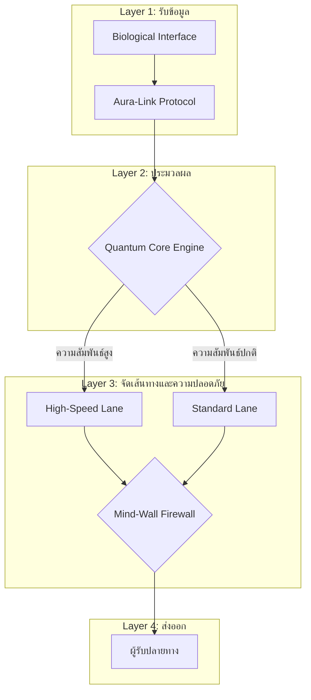

#  Aura-Link Communication Architecture (Mockup)

##  System Overview
Aura-Link is a conceptual thought-based communication system that processes emotional and relational signals and routes them through a secure quantum-inspired architecture.

---

##  System Architecture Diagram

## 🔷 ภาพรวมโครงสร้างแบบ Layer

---

##  System Logic Mapping

| เลเยอร์ (Layer) | ส่วนงาน (Component) | โลจิคในโค้ด (Code Logic) | หน้าที่ (Function) |
|------------------|----------------------|----------------------------|-----------------------------|
| **Layer 1** | Biological Interface | `input()` | รับสัญญาณชีพจรจำลอง |
| **Layer 2** | Aura-Link Protocol | `time.sleep()` | ประมวลผลและเข้ารหัสข้อมูลอารมณ์ |
| **Layer 3** | Quantum Core | `if tie_score >= 0.7` | เลือกเส้นทางส่งข้อมูลตามความสัมพันธ์ |
| **Layer 4** | Mind-Wall Firewall | Security Check | ตรวจสอบความปลอดภัยก่อนส่งออก |
| **Layer 5** | Output | `print()` | ยืนยันการส่งข้อมูลถึงผู้รับ |

---

##  Security Concept

- Emotional-weight routing
- Relationship-based prioritization
- Firewall verification before delivery
- Secure emotional signal transmission

---

##  Concept Highlights

- Emotion Vector Processing  
- Weighted Relationship Routing  
- Quantum-inspired Secure Communication  
- Multi-layer Neural Architecture  

---
