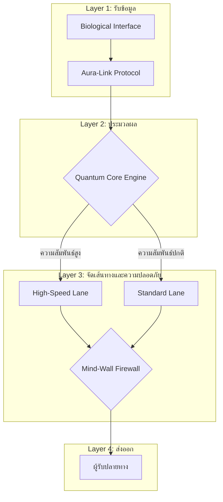

#  Aura-Link Communication Architecture (Mockup)

##  ภาพรวมระบบ (System Overview)

Aura-Link เป็นแนวคิดระบบสื่อสารผ่านความคิด
ที่ประมวลผลสัญญาณทางอารมณ์และระดับความสัมพันธ์
จากนั้นจัดเส้นทางการส่งข้อมูลผ่านสถาปัตยกรรมที่ได้รับแรงบันดาลใจจากแนวคิดควอนตัม
โดยเน้นความปลอดภัยของข้อมูลเป็นสำคัญ

---

##  System Architecture Diagram

## 🔷 ภาพรวมโครงสร้างแบบ Layer

---

##  System Logic Mapping

| เลเยอร์ (Layer) | ส่วนงาน (Component) | โลจิคในโค้ด (Code Logic) | หน้าที่ (Function) |
|------------------|----------------------|----------------------------|-----------------------------|
| **Layer 1** | Biological Interface | `input()` | รับสัญญาณชีพจรจำลอง |
| **Layer 2** | Aura-Link Protocol | `time.sleep()` | ประมวลผลและเข้ารหัสข้อมูลอารมณ์ |
| **Layer 3** | Quantum Core | `if tie_score >= 0.7` | เลือกเส้นทางส่งข้อมูลตามความสัมพันธ์ |
| **Layer 4** | Mind-Wall Firewall | Security Check | ตรวจสอบความปลอดภัยก่อนส่งออก |
| **Layer 5** | Output | `print()` | ยืนยันการส่งข้อมูลถึงผู้รับ |

---

##  แนวคิดด้านความปลอดภัย (Security Concept)

- การจัดเส้นทางข้อมูลตามระดับความเข้มของอารมณ์ (Emotional-weight Routing)

- การกำหนดลำดับความสำคัญตามระดับความสัมพันธ์ (Relationship-based Prioritization)

- การตรวจสอบผ่าน Firewall ก่อนส่งถึงผู้รับ

- การส่งข้อมูลอารมณ์แบบปลอดภัยและเข้ารหัส

---

##  จุดเด่นของแนวคิด (Concept Highlights)

- การประมวลผลเวกเตอร์อารมณ์ (Emotion Vector Processing)

- การจัดเส้นทางตามน้ำหนักความสัมพันธ์ (Weighted Relationship Routing)

- การสื่อสารที่ได้รับแรงบันดาลใจจากแนวคิดควอนตัมและมีความปลอดภัยสูง

- สถาปัตยกรรมแบบหลายชั้น (Multi-layer Neural Architecture) 

---
