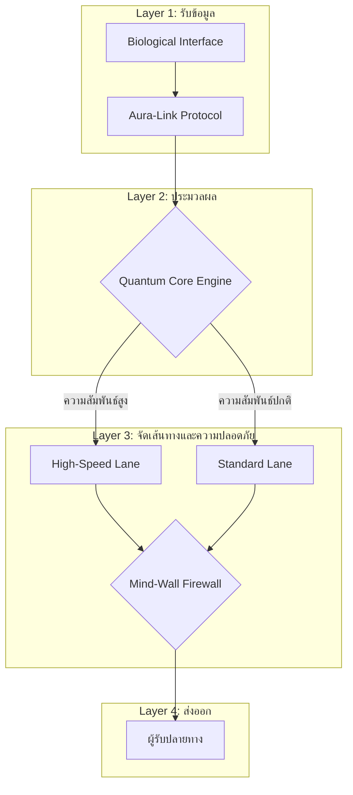

#  Aura-Link: ระบบสื่อสารผ่านความคิด (Brain-to-Brain Communication)

---

##  บทนำโครงการ (Project Pitch)

###  ปัญหา (Problem Statement)
ปัจจุบันการสื่อสารยังต้องพึ่งพาภาษา อุปกรณ์ หรือการพิมพ์  
ซึ่งอาจเกิดข้อจำกัดด้านความเร็ว ความเข้าใจอารมณ์ ความเป็นส่วนตัว และการเข้าถึงสำหรับผู้พิการทางการสื่อสาร

###  แนวทางแก้ไข (Solution)
Aura-Link เป็นแนวคิดระบบสื่อสารผ่านสัญญาณสมอง  
ที่สามารถ:
- ส่งข้อมูลอารมณ์โดยตรง
- จัดลำดับความสำคัญตามระดับความสัมพันธ์
- ส่งข้อมูลอย่างปลอดภัยผ่านระบบเข้ารหัส

###  กลุ่มผู้ใช้งานเป้าหมาย
- ครอบครัว (ความสัมพันธ์ใกล้ชิด)
- ผู้ป่วยที่ไม่สามารถพูดได้
- งานด้านความมั่นคง/ฉุกเฉิน
- เทคโนโลยีปฏิสัมพันธ์มนุษย์-คอมพิวเตอร์ในอนาคต

###  ผลกระทบที่คาดหวัง
- การสื่อสารรวดเร็วขึ้น
- ลดความเข้าใจผิดทางอารมณ์
- เพิ่มโอกาสการเข้าถึงการสื่อสาร
- วางรากฐานเทคโนโลยีเครือข่ายสมองในอนาคต

---

#  สถาปัตยกรรมระบบ (System Architecture)

## 🔷 ภาพรวมโครงสร้างแบบ Layer

---

##  ลำดับการทำงานของระบบ (Data Flow)

1. อุปกรณ์รับสัญญาณชีวภาพจากสมอง  
2. แปลงเป็น Emotion Vector ผ่าน Aura-Link Protocol  
3. คำนวณค่า `tie_score` เพื่อประเมินระดับความสัมพันธ์  
4. เลือกเส้นทางการส่งข้อมูล  
5. ตรวจสอบความปลอดภัยผ่าน Firewall  
6. ส่งข้อมูลไปยังผู้รับ  

---

#  การเชื่อมโยงกับตรรกะโค้ด (Code Logic Mapping)

| เลเยอร์ | ส่วนประกอบ | ตัวอย่างตรรกะในโค้ด | หน้าที่ |
|----------|-------------|---------------------|----------|
| รับข้อมูล | Biological Interface | `input()` | รับสัญญาณสมอง |
| ประมวลผล | Aura-Link Protocol | `encode(signal)` | แปลงเป็นเวกเตอร์อารมณ์ |
| จัดเส้นทาง | Quantum Core | `if tie_score >= 0.7` | เลือกเส้นทางส่งข้อมูล |
| ความปลอดภัย | Mind-Wall Firewall | `validate(token)` | ตรวจสอบสิทธิ์ |
| ส่งออก | Receiver Node | `print("Delivered")` | ยืนยันการส่งสำเร็จ |

---

#  แผนการพัฒนา (Sprint Plan)

## Sprint 1 – ออกแบบระบบ
- กำหนดโมเดลสัญญาณสมอง
- ออกแบบสถาปัตยกรรมแบบ Layer
- ออกแบบอัลกอริทึมการจัดเส้นทาง

## Sprint 2 – พัฒนาแกนหลัก
- จำลอง Emotion Vector
- พัฒนาตรรกะ tie_score
- พัฒนา Firewall ตรวจสอบความปลอดภัย

## Sprint 3 – ทดสอบและจัดทำ Mockup
- ทดสอบการเลือกเส้นทาง
- ทดสอบระบบความปลอดภัย
- จัดทำเอกสารและนำเสนอ

---

# 🧪 แผนการทดสอบ (Test Plan)

| กรณีทดสอบ | ค่าที่ป้อนเข้า | ผลลัพธ์ที่คาดหวัง |
|------------|---------------|-------------------|
| ความสัมพันธ์สูง | tie_score = 0.85 | ใช้ High-Speed Lane |
| ความสัมพันธ์ต่ำ | tie_score = 0.40 | ใช้ Standard Lane |
| ผู้ใช้ไม่ได้รับอนุญาต | token ไม่ถูกต้อง | ถูกบล็อกโดย Firewall |
| ค่าใกล้ขอบเขต | tie_score = 0.70 | จัดเป็น High-Speed Lane |

---

#  ความปลอดภัยของระบบ (Security Architecture)

- การเข้ารหัสแบบ End-to-End  
- การควบคุมสิทธิ์ตามระดับความสัมพันธ์  
- การกรองข้อมูลอารมณ์  
- Firewall ตรวจสอบก่อนส่งออก  
- การยืนยันตัวตนด้วย Token  

---

#  ความเสี่ยงและจริยธรรม (Risk & Ethics)

- การละเมิดความเป็นส่วนตัวทางสมอง  
- การบิดเบือนอารมณ์  
- การปลอมแปลงตัวตน  
- ปัญหาความเป็นเจ้าของข้อมูล  

แนวทางลดความเสี่ยง:
- เข้ารหัสข้อมูล
- ระบบยืนยันตัวตนหลายชั้น
- บันทึกประวัติการใช้งาน (Audit Log)
- นโยบายกำกับดูแลด้านจริยธรรม

---

#  บทบาทในทีม

- Architect – ออกแบบสถาปัตยกรรม
- Engineer – พัฒนาอัลกอริทึมและระบบหลัก
- DevOps – วางแผน Sprint และโครงสร้างระบบ
- QA/Tester – ออกแบบและดำเนินการทดสอบ

---

#  บทสรุป

Aura-Link เป็นแนวคิดต้นแบบของระบบสื่อสารผ่านสัญญาณสมอง  
ที่ผสานแนวคิดด้านสถาปัตยกรรมระบบ การจัดเส้นทางข้อมูล และความปลอดภัย  
เพื่อสร้างต้นแบบเทคโนโลยีการสื่อสารแห่งอนาคต

---
